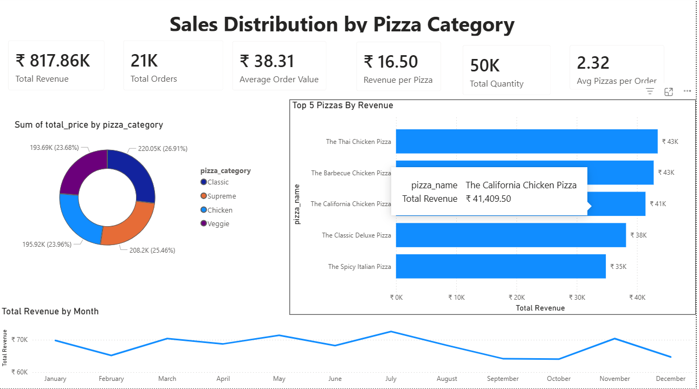
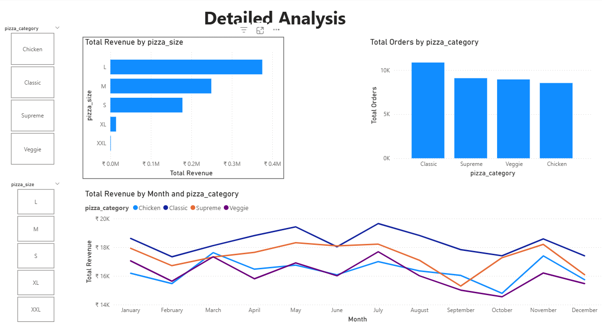

#  Pizza Sales Power BI Dashboard

##  Project Overview
This project presents an interactive Power BI dashboard analyzing pizza sales performance.
The dashboard provides insights into revenue trends, order distribution, and category-wise performance.

---

##  Business Objectives
- Analyze total revenue and total orders
- Identify top-performing pizza categories
- Track monthly revenue trends
- Compare revenue by pizza size
- Enable interactive filtering using slicers

---

##  Key Insights
- Classic category generated the highest number of orders.
- Large (L) size pizzas contributed the highest revenue.
- Revenue peaks observed in July and November.
- Chicken and Supreme categories show consistent performance.

---

##  Tools Used
- Power BI
- DAX (Data Analysis Expressions)
- Data Modeling
- Interactive Slicers & Visualizations

---

##  Dashboard Preview

### Page 1 – Sales Overview

### Page 2 – Detailed Analysis

---

##  Files Included
- Pizza-Sales-Analysis-PowerBI.pbix
- Dashboard screenshots
- Project documentation

---

## 🚀 Author
**Akash Pasala**  
Aspiring Data Analyst | Computer Science Student
